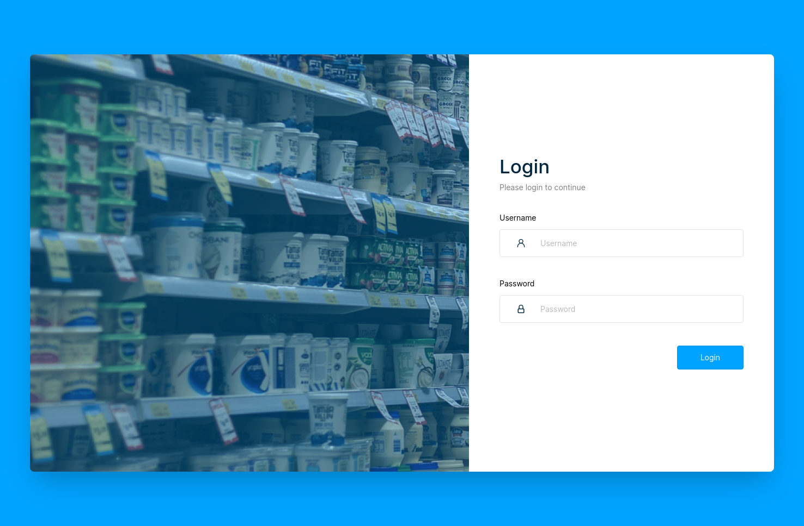
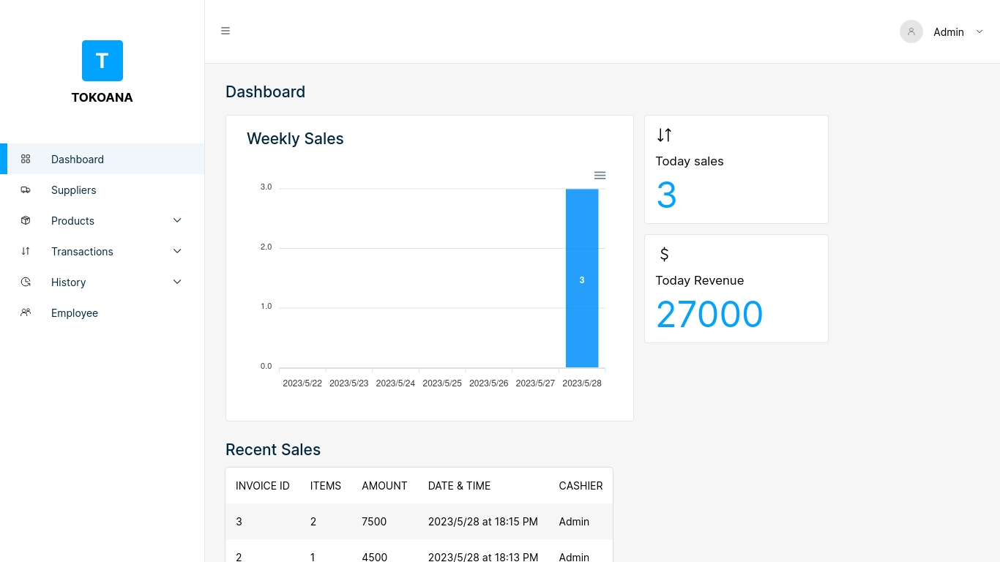
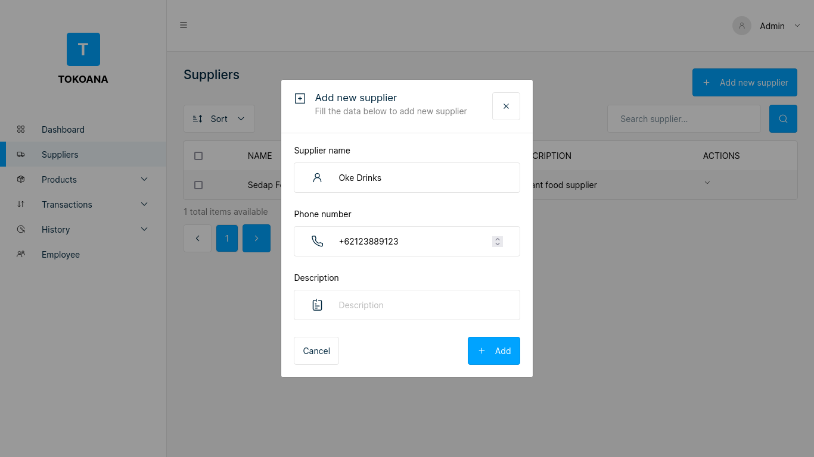
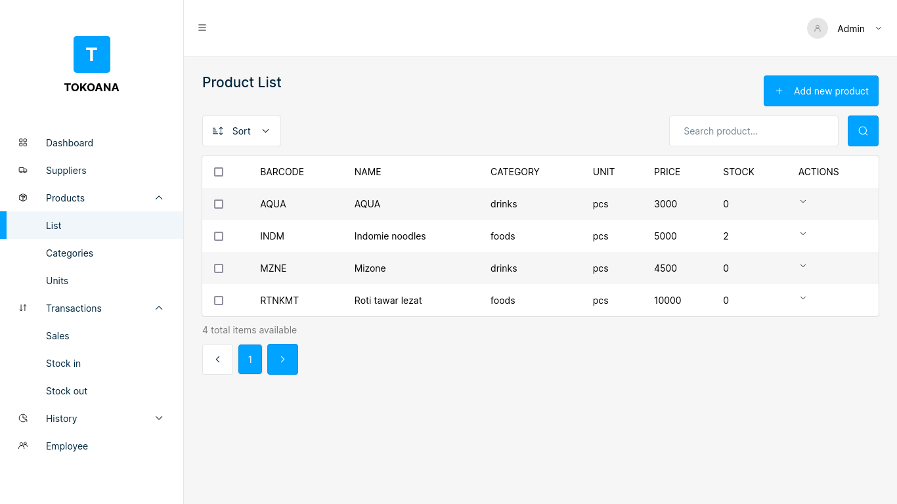
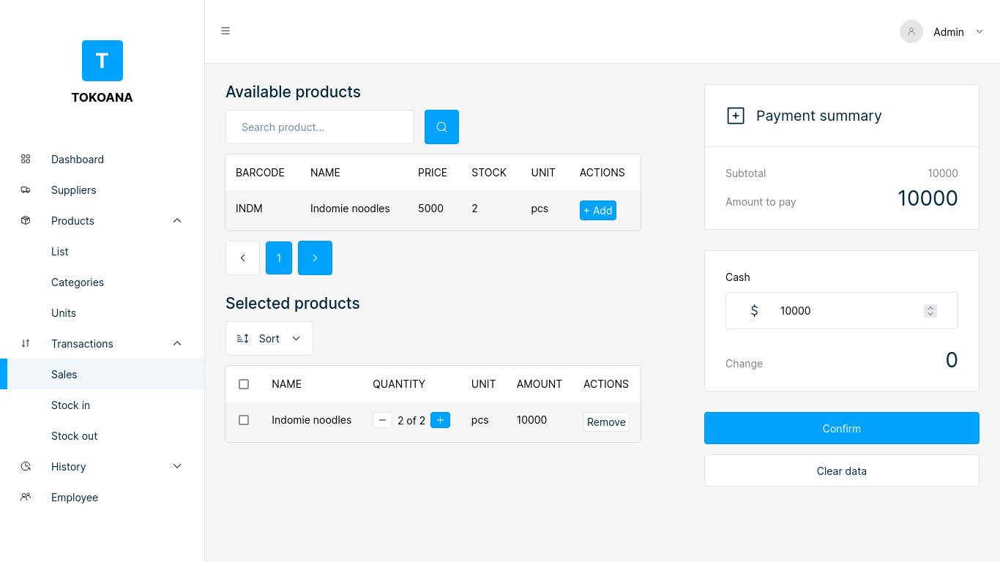

# Tokoana - Point of Sales App

## About Tokoana

### Tokoana is a point of sales application, used to help cashiers or shop owners to manage the products being sold.

## Features

-   CRUD Product category, list & unit
-   Create transactions sales, stock in & stock out
-   Print transaction detail
-   History transaction
-   Multi role user admin & cashier

## Screenshots

## Library / Framework used

-   [Vue JS](vuejs.org)
-   [Inertia JS](https://inertiajs.com/)
-   [Laravel](laravel.com)
-   [pdfMake](pdfmake.github.io)
-   [ApexCharts](https://apexcharts.com/)
-   [SASS](sass-lang.com)
